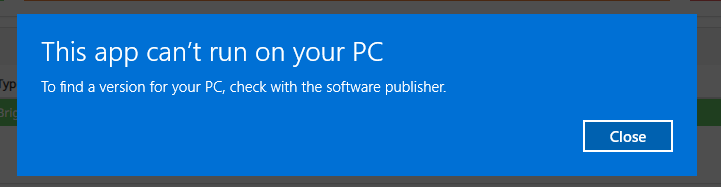

# README: Installing Docker Engine Using WSL

This README describes how to resolve the "Can't Run This App on Your PC" error encountered while installing Docker Engine on Windows 10 by using Windows Subsystem for Linux (WSL).

---

## Problem Statement
While attempting to install Docker Engine on Windows 10, the following error message was encountered:

## Problem Statement
While attempting to install Docker Engine on Windows 10, the following error message was encountered:





To resolve this issue, reinstalling Windows 10 and using WSL to install Docker Engine is the recommended solution.

---

## Solution: Install Docker Engine Using WSL

Follow these steps to install Docker Engine on your local machine using WSL:

### Step 1: Enable WSL
1. Open PowerShell as Administrator.
2. Run the following command to enable the WSL feature:
   ```powershell
   wsl --install
   ```
   This command installs the default Linux distribution (Ubuntu) and enables the required features.

3. Restart your computer if prompted.

### Step 2: Verify Installation
1. After restarting, open a terminal (PowerShell or Command Prompt).
2. Run the following command to check the WSL version:
   ```powershell
   wsl --version
   ```
   Ensure that WSL 2 is installed.

### Step 3: Set WSL Version
1. To set WSL 2 as the default version, run:
   ```powershell
   wsl --set-default-version 2
   ```

### Step 4: Install a Specific Linux Distribution (Optional)
1. To list available distributions, run:
   ```powershell
   wsl --list --online
   ```
2. To install a specific distribution (e.g., Ubuntu), run:
   ```powershell
   wsl --install -d Ubuntu
   ```

### Step 5: Install Docker Engine in WSL
1. Launch your Linux distribution from WSL.
2. Update your package list:
   ```bash
   sudo apt update
   ```
3. Install Docker Engine:
   ```bash
   sudo apt install docker.io
   ```
4. Start the Docker service:
   ```bash
   sudo service docker start
   ```
5. Verify the installation by running:
   ```bash
   docker --version
   ```

---

## Additional Notes
- Reinstalling Windows 10 may be necessary to resolve persistent system issues.
- Ensure that your system meets the prerequisites for running WSL and Docker Engine.
- For detailed Docker setup instructions, refer to the [official Docker documentation](https://docs.docker.com/).

Enjoy using Docker on your local machine with the power of WSL!

